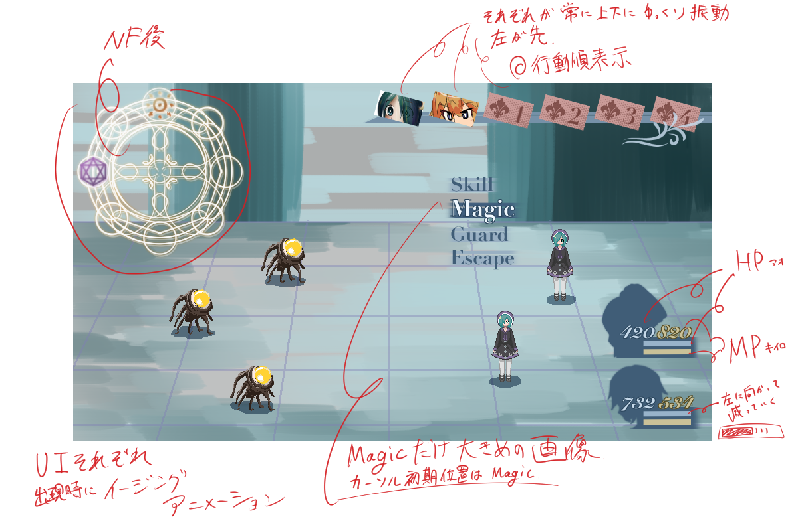
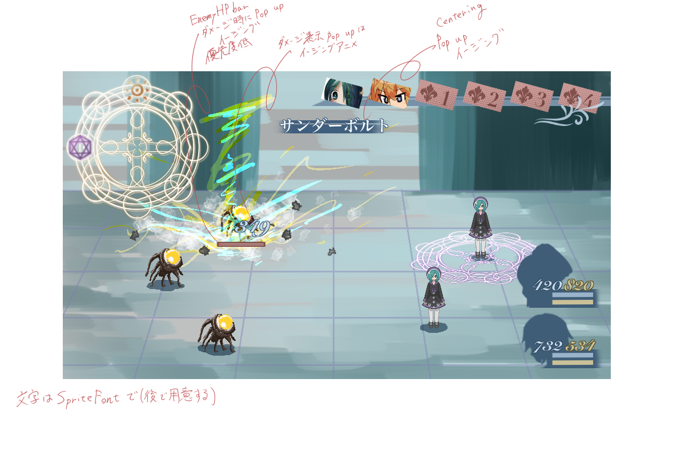

CTBやりたい！！！！！！！

### 行動順決定

戦闘開始時に各キャラクターに対しWaitPoint（WP）を内部的に8000~12000として設定  
それぞれのWPから各キャラクターのSPDを減算することを繰り返し、最初にWPが0以下になったキャラクターから順に行動する。  
行動後は各行動に応じてWPを加算する。  
WPが負の値をとった場合はその値にそのまま行動後にWPを加算（0にリセットしない）。  
行動順は前もってある程度（行動次第で前後することもある）計算し、行動順予定を画面に表示（８つくらい？）。  
加算するWPは10000を基準とする。行動順表示用に前もって計算する際にはこれを基準値とする。  

参考: http://newrpg.seesaa.net/article/453573404.html

## 選択肢
 - 魔法
 - スキル（通常攻撃含む）
 - 防御
 - 逃げる

下記の行動順判定によって行動順を決定、順番が来るたびに当該キャラクターの行動を決定・実行？

### 防御
受けるダメージを40%にする

### 逃げる
イベント戦以外必ず逃走成功

## 暫定パラメータ
 - HP
    - 尽きたらダウン
        - 味方全員ダウンでゲームオーバー
    - 戦闘終了で全回復
    - プレイヤーのHP強化最大値は999
 - MP
    - 魔法を使うと消費
    - [1,999]
 - Special
    - ダメージを受けたら溜まる超必殺技用
    - 1000溜まったら発動可能
    - 戦闘開始時は一律で0
 - STR
    - 物理攻撃の威力に関係する
    - [1,99]
 - VIT
    - 物理・魔法攻撃から受けるダメージの量に関係する
    - [1,99]
 - MAG
    - 魔法攻撃の威力と魔法攻撃から受けるダメージの量に関係する
    - [1,99]
 - SPD
    - 行動順・回避率・命中率に関係する
    - [1,99]
 - 物理攻撃力(pATK)
    - 武器に設定される攻撃力。物理攻撃の威力に影響。
    - [1,99]
 - 魔法攻撃力(mATK)
    - 武器に設定される攻撃力。魔法攻撃の威力に影響。
 - 物理防御力(pDEF)
    - 装備に設定される防御力。物理攻撃から受けるダメージの量に関係。
 - 魔法防御力(mDEF)
    - 装備に設定される防御力。魔法攻撃から受けるダメージの量に関係。


装備によってこれらのパラメータに値を上乗せする  
Lvアップで能力値上昇（上昇率・経験値テーブルは今後つくります）

## 参考初期パラメータ例

 - ルーネ（魔法使い主人公）
    - HP 80
    - MP 120
    - STR 6
    - VIT 10
    - MAG 44
    - SPD 8

 - サニィ（魔法使い格闘家）
    - HP 160
    - MP 70
    - STR 18
    - VIT 20
    - MAG 24
    - SPD 22

 - 敵(よわめ,コウモリイメージ)
     - HP 80
     - MP (infinity)
     - STR 18
     - VIT 10
     - MAG 8
     - SPD 25

 - 敵（つよめ,ゴブリンみたいなの）
     - HP 320
     - MP (infinity)
     - STR 25
     - VIT 20
     - MAG 2
     - SPD 5

## 戦闘計算式（暫定）
戦闘終了でHPは全回復するのでバトル自体でのダメージは大きめの(2~3発で死ぬ)調整にしたい  
繊細な部分なのでしっかり調整していきたい  
aを攻撃側、bを防御側とする  
技・魔法毎に威力(force)を設定する  
最終ダメージに乱数として80～120%を乗算
### 攻撃
#### 物理攻撃の場合
(a.STR\*a.pATK\*force*24)/(a.STR\*a.pATK+1500)\*(400-b.VIT-b.pDEF\*2)/400\*(補正項)

#### 魔法攻撃の場合
((a.MAG\*a.mATK\*force*24)/(a.MAG\*a.mATK+1500))\*((400-(b.VIT+b.MAG\*2)/3-b.mDEF\*2)/400)\*(補正項)

### 補正項
属性ダメージ軽減など装備によって割合軽減など

### クリティカルヒット
攻撃時5\%で発生  
発生時は防御側のVIT・MAGを0として計算する

## 割り込みスキル（カウンターなど）
味方または敵が行動時，対立勢力側がカウンター用のスキルやカウンター行動バフを所持していた場合，確率で攻撃を無効化して発動する．カウンター行動に対して再びカウンターが発生するといったことはない．

### かばう
味方に「かばう」発動中のキャラクターがいる時に確定で発生．
味方単体を対象とする攻撃を肩代わりする．

### カウンター
自身を対象とした物理攻撃に対して確率で発生．攻撃を無効化して反撃する．

### 魔法キャンセル
相手が魔法を発動時に（確率|確定）で発生．魔法を無効化する．

## パッシブスキル
所有しているだけで効果があるスキル．戦闘計算時に，

```cs
if (target.HasSkill(SkillID.Resist)) damage *= 0.5f;
```

みたいに処理するイメージです．

「どの術の系統を選択して習得するか」がゲームのアピールポイントなので，アクティブスキルに限らずパッシブスキルも考慮して迷えるようにしたい．

### パッシブスキル例
- 属性耐性上昇
- パラメータ上昇
- 毎ターン回復
- 確率オートカウンター

## 場の概念
同じ系統の魔法ばかりを使い続けるとその系統の魔法が弱くなり、相反する系統の魔法が強くなる。  
~~現在の状態は円形の図で表現する。~~ 
表現せずマスクされた値として扱う．

 - シンプルな実装

初期値はマップやイベントによって異なる．基準値を100とする．上限200，下限を0とする．  
陽術を用いた場合、陽術を-20、隣接する音・樹の評価パラメータを-10し、  
相反する陰術を+20、隣接する鋼・忍を+10する。  
~~表示点はパラメータをそれぞれ独立に表した場合の点の重心におく。~~  
~~この実装だと、見た目と効果量に違いが出る場合がある。~~ 


術使用時のダメージ量・回復量・効果時間に最終倍率として以下の倍率tを適用する．値をpとして，

t = 0.5 + 0.5 * (p / 100)

とする．

## 戦闘画面イメージ



### 選択肢
#### スキル
HPを消費して発動する．

#### マジック
MPを消費して発動する．

##### 魔法リスト
実装済のフィールドシーンでのスキルリストのように，術の系統ごとにカテゴリ分けされたウィンドウを表示する．




### 演出

#### 魔法発動シーケンス

- (魔法決定)
- プレイヤーの入力をカット
- 技名表示+キャラクター詠唱モーション
- キャラクター発動モーション+魔法エフェクト
- 敵やられモーション
  - 用意できればやられモーション用スプライト
  - スプライトのシェイクでヒット感を演出
- ダメージ表示
- 技名表示オフ
- 次の行動へ

