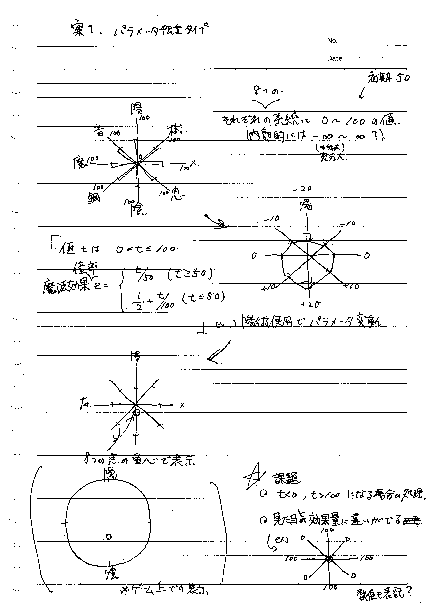
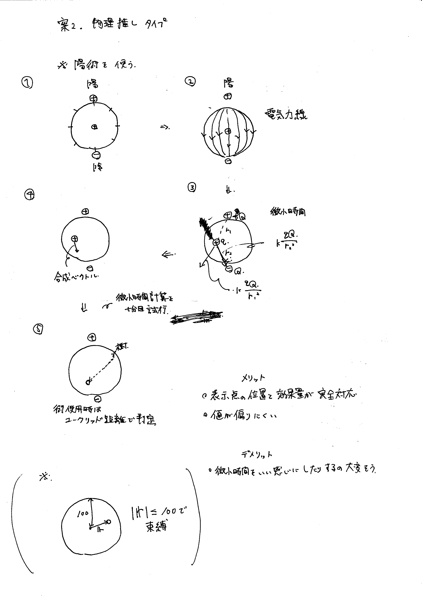

CTBやりたい！！！！！！！

### 行動順決定

戦闘開始時に各キャラクターに対しWaitPoint（WP）を内部的に8000~12000として設定  
それぞれのWPから各キャラクターのSPDを減算することを繰り返し、最初にWPが0以下になったキャラクターから順に行動する。  
行動後は各行動に応じてWPを加算する。  
WPが負の値をとった場合はその値にそのまま行動後にWPを加算（0にリセットしない）。  
行動順は前もってある程度（行動次第で前後することもある）計算し、行動順予定を画面に表示（８つくらい？）。  
加算するWPは10000を基準とする。行動順表示用に前もって計算する際にはこれを基準値とする。  

参考: http://newrpg.seesaa.net/article/453573404.html

## 選択肢
 - 魔法
 - スキル（通常攻撃含む）
 - 防御
 - 逃げる

下記の行動順判定によって行動順を決定、順番が来るたびに当該キャラクターの行動を決定・実行？

### 防御
受けるダメージを40%にする

### 逃げる
イベント戦以外必ず逃走成功

## 暫定パラメータ
 - HP
    - 尽きたらダウン
        - 味方全員ダウンでゲームオーバー
    - 戦闘終了で全回復
    - プレイヤーのHP強化最大値は999
 - MP
    - 魔法を使うと消費
    - [1,999]
 - Special
    - ダメージを受けたら溜まる超必殺技用
    - 1000溜まったら発動可能
    - 戦闘開始時は一律で0
 - STR
    - 物理攻撃の威力に関係する
    - [1,99]
 - VIT
    - 物理・魔法攻撃から受けるダメージの量に関係する
    - [1,99]
 - MAG
    - 魔法攻撃の威力と魔法攻撃から受けるダメージの量に関係する
    - [1,99]
 - SPD
    - 行動順・回避率・命中率に関係する
    - [1,99]

装備によってこれらのパラメータに値を上乗せする  
Lvアップで能力値上昇（上昇率・経験値テーブルは今後つくります）

## 参考初期パラメータ例

 - ルーネ（魔法使い主人公）
    - HP 80
    - MP 120
    - STR 6
    - VIT 10
    - MAG 44
    - SPD 8

 - サニィ（魔法使い格闘家）
    - HP 160
    - MP 70
    - STR 18
    - VIT 20
    - MAG 24
    - SPD 22

 - 敵(よわめ,コウモリイメージ)
     - HP 80
     - MP (infinity)
     - STR 18
     - VIT 10
     - MAG 8
     - SPD 25

 - 敵（つよめ,ゴブリンみたいなの）
     - HP 320
     - MP (infinity)
     - STR 25
     - VIT 20
     - MAG 2
     - SPD 5

## 戦闘計算式（暫定）
戦闘終了でHPは全回復するのでバトル自体でのダメージは大きめの(2~3発で死ぬ)調整にしたい  
繊細な部分なのでしっかり調整していきたい  
aを攻撃側、bを防御側とする
最終ダメージに乱数として80～120%を乗算
### 通常攻撃
MAX(a.STR\*4-b.VIT\*2,5)\*(補正項)
### 魔法・スキル
魔法はそれぞれの魔法で計算式を設定する
#### 一例
MAX(a.MAG\*4-(b.VIT+b.MAG),0)\*(補正項)

### 補正項
属性ダメージ軽減など装備によって割合軽減など

### クリティカルヒット
攻撃時5\%で発生  
発生時は防御側のVIT・MAGを0として計算する

## 場の概念
同じ系統の魔法ばかりを使い続けるとその系統の魔法が弱くなり、相反する系統の魔法が強くなる。  
現在の状態は円形の図で表現する。  

 - 案1 シンプルな実装
 
陽術を用いた場合、陽術を-20、隣接する音・樹の評価パラメータを-10し、  
相反する陰術を+20、隣接する鋼・忍を+10するのみとする。  
表示点はパラメータをそれぞれ独立に表した場合の点の重心におく。  
この実装だと、見た目と効果量に違いが出る場合がある。

 - 案2 物理学的なアプローチ

陽術を用いた場合、陽術の位置に+の電荷、相反する陰術の位置に-の電荷があると考え、表示点を電荷として移動させる方法である。  
術の使用時は表示点とそれぞれの術が対応する位置とのユークリッド距離を計算して効果量を考える。  
この場合、表示点の位置と効果量が完全に対応する上、例えば表示点が陰に寄りすぎた場合に陽術を使うと大きく陽術側に移動するなど、  
バランスのよい挙動が期待される。  
出来そうならこっちがいい。  

他に案があればぜひ聞きたい......  